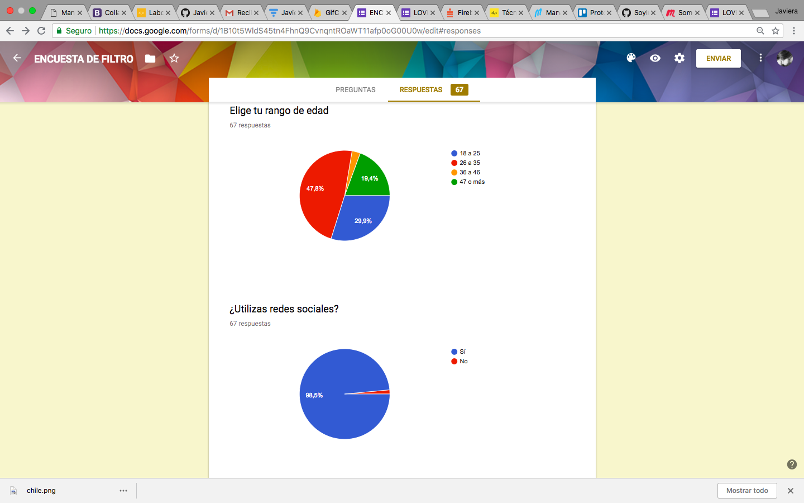
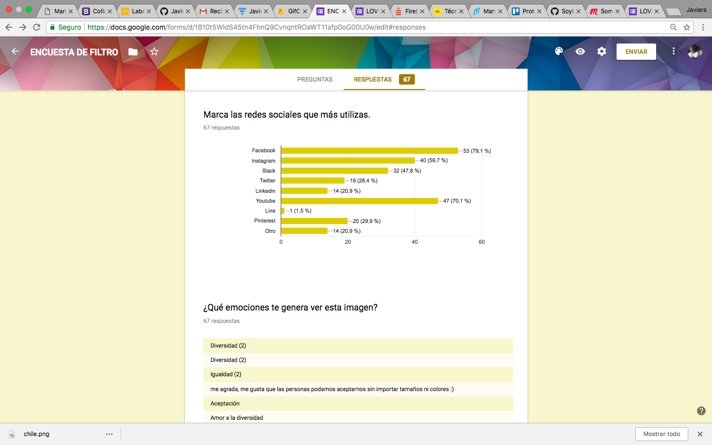
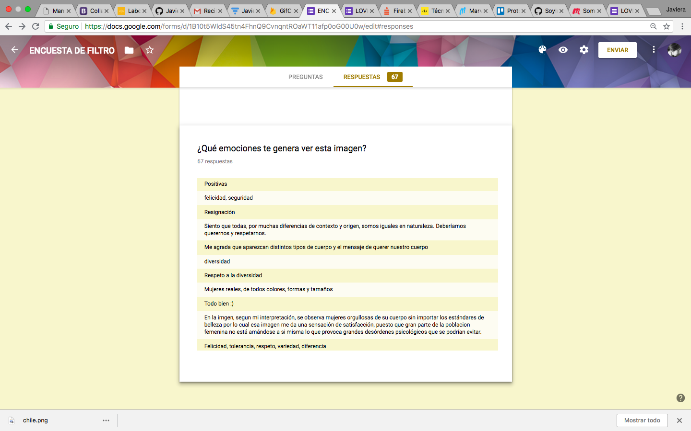
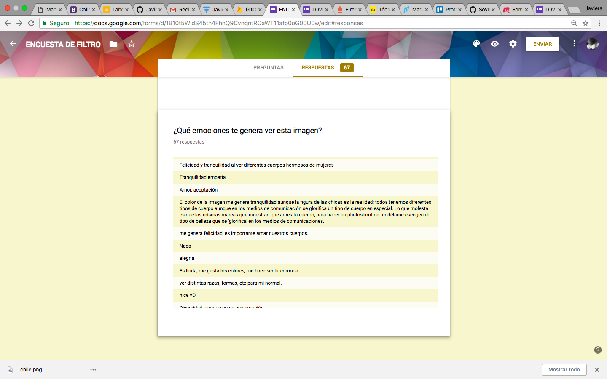
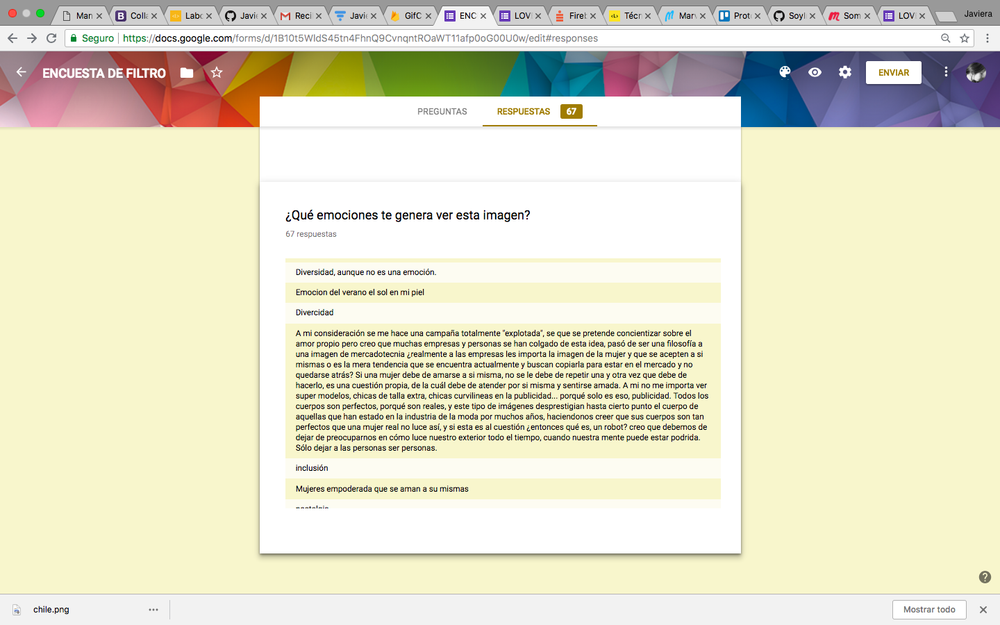
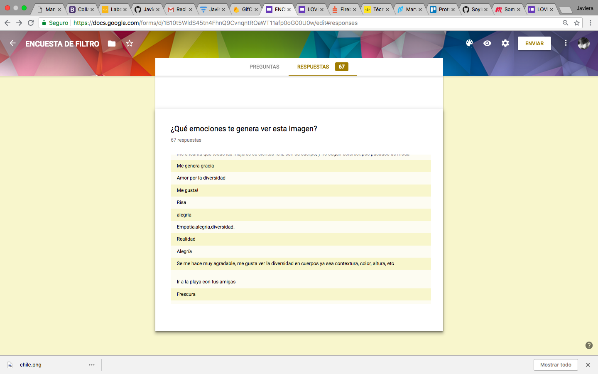
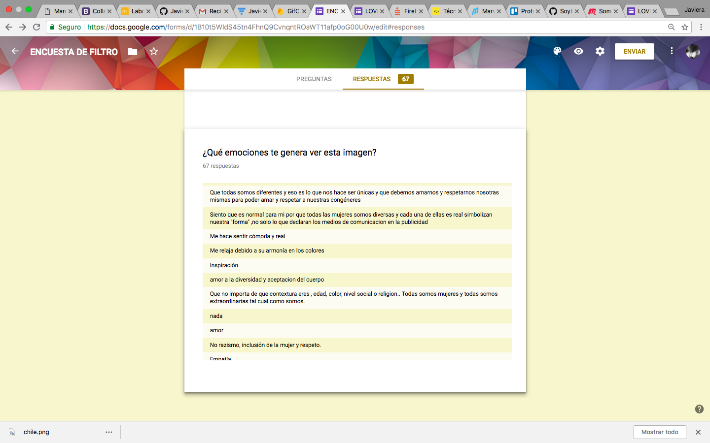
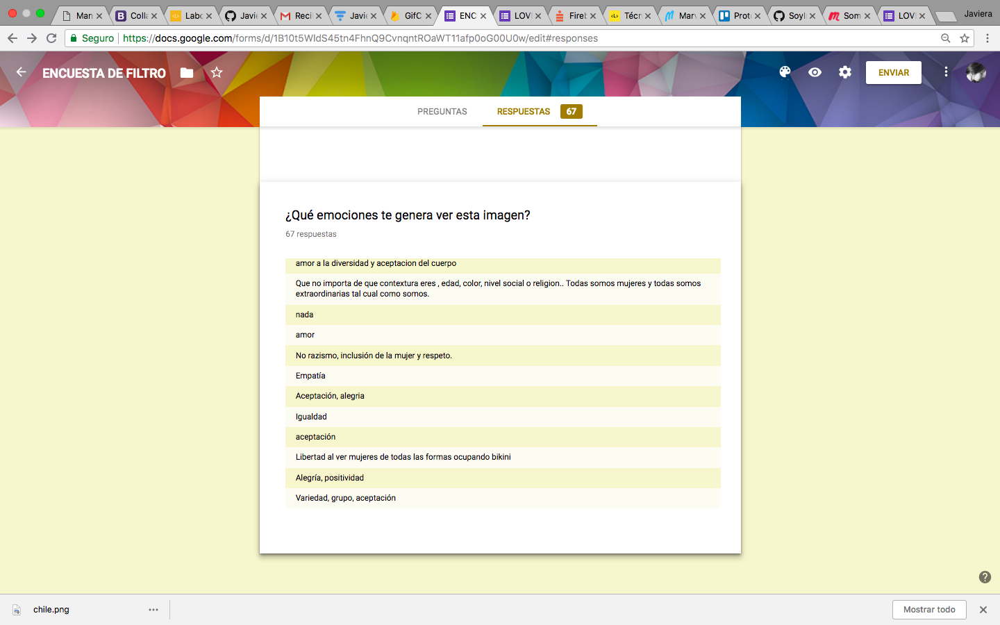

# Proyecto red social

## Preámbulo

Un emprendedor muy visionario nos ha encargado crear una red social. No nos da mucho detalle sobre qué tipo de red social quiere, él solo nos dice que creemos la que mejor podamos y que luego lo convenzamos de que nuestra red social será la más exitosa. El emprendedor nos da ciertos tópicos en los que le gustaría invertir. Estos son:

- Alimentación
- Feminismo
- Educación
- Salud
- Energías Renovables

# Love Your Body

## Introducción

¿Te gusta verte bien? pero ¿te cuesta encontrar ropa adecuada a tu cuerpo y estilo? ¿crees que solo a ti te pasa? ¿te sientes diferente a l@s demás?

Muchas mujeres sienten que es una odisea poder quedar encontrar vestimenta a su medida y a su estilo. o les apena ser catalogadas de descuidadas con su alimentación por su contextura física. Si eres parte de este grupo tranquila, aquí te presentamos nuestro nuestro proyecto que te ayudrá a sentirte mejor.

Somos Valeria, Viviana, Loreto y Javiera y queremos dar solución a tu problema.

Para ello tenemos una red social "Love Your Body", donde junto a otras mujeres encontrarás contensión y podrás compartir experiencias que te ayudarán a aceptar y valorar tu cuerpo. 
Siempre recuerda "No solo l@s delgad@s pueden verse bien".

Por medio de la interacción social podrás:

- Sentirte segura con tu cuerpo.
- Tener una red de apoyo (Recuerda que no eres la única).
- Encontrar datos interesantes de tiendas maravillosas que te ofrecen      ropa a tu medida y estilo.
- Asistir a eventos interesantes de tu interés.
- Recibir tips de alimentación saudable.

Si eres parte de nuestra red social **Love Your Body** no te sentirás sola, y entenderás que NO necesitas cambiar tu aspecto físico para sentirte bien y segura de ti misma.

Ésta red social fue creada para mujeres y por mujeres que entienden a fondo tus precupaciones y te harán sentir única, con una autoestima equilibrada y feliz.

Si quieres ser parte de esta red social de mujeres positivas, Únete!!

## Encuesta de filtro

Para poder recolectar datos de mujeres que utilizan redes sociales y les parece genial la idea de una red social feminista realizamos la siguiente encuesta.

### Resultados obtenidos en encuesta de filtro

### Conclusion obtenida

## Prototipo de Baja fidelidad

## Prototipo de Alta fidelidad

## Trello, Planificación de proyecto.

Si quieres ver como nos organizamos para cumplir nuestros objetivos y a la vez conocer las tareas que realizamos cada una ingresa a aquí...

## Prototipo de baja fidelidad.

